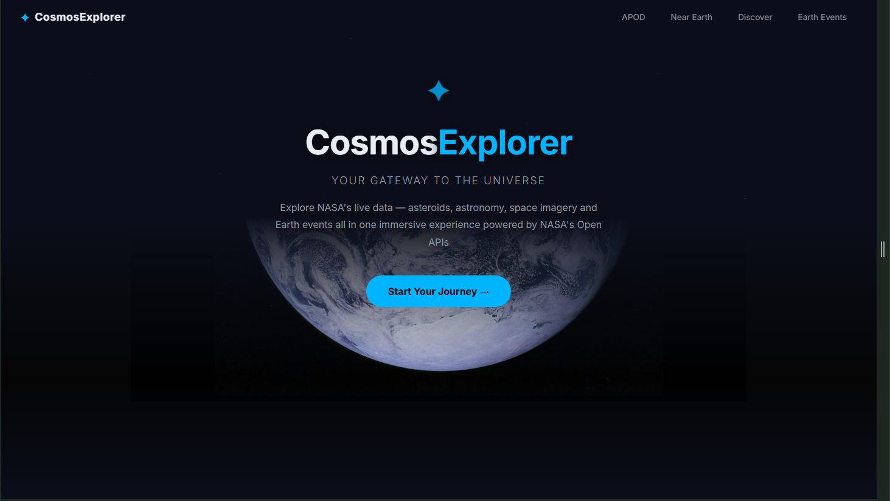
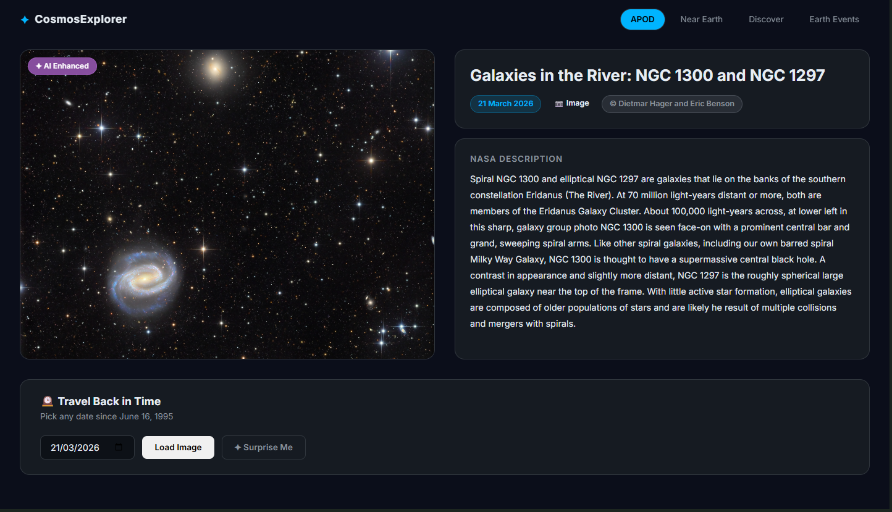
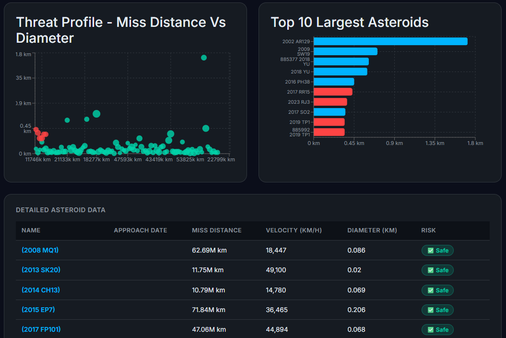
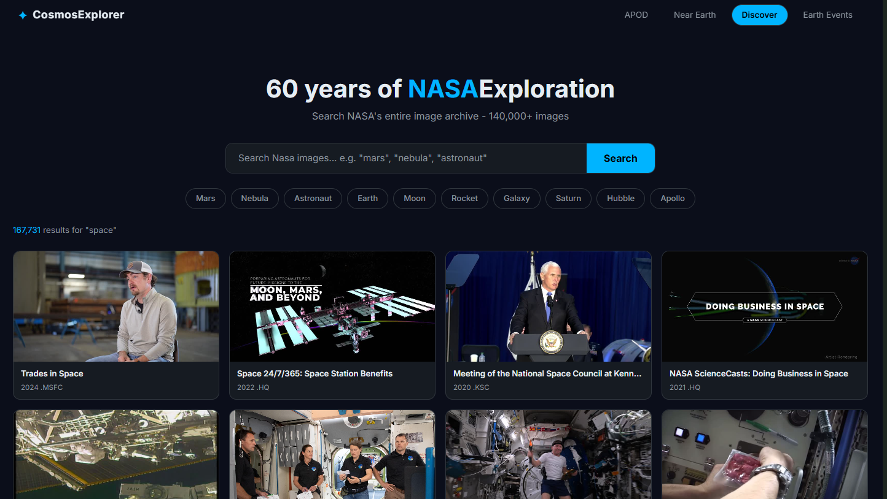
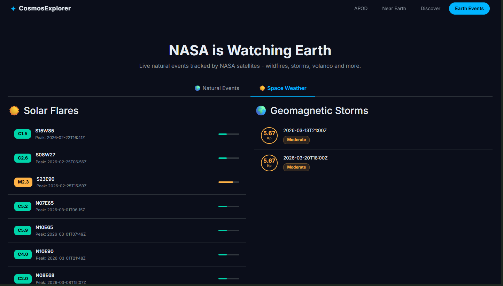

<div align="center">

# ✦ CosmosExplorer

### Your gateway to the universe

[](https://reactjs.org)
[](https://nodejs.org)
[](https://expressjs.com)
[](https://redis.io)
[](https://api.nasa.gov)

**[🚀 Live Demo](YOUR_VERCEL_URL)** · **[🔧 API](YOUR_RENDER_URL)**

</div>

---

## 📖 What is CosmosExplorer?

CosmosExplorer is a full-stack web application that makes NASA's
open data accessible and beautiful. Built as a technical assessment
for Bounce Insights, it aggregates four NASA APIs into a single
immersive experience — from daily astronomy photography to
real-time asteroid tracking and live Earth event monitoring.

---

## ✨ Features

### 🌌 APOD — Astronomy Picture of the Day

- Fetches NASA's daily astronomy image or video
- Time travel — explore any date since June 16, 1995
- Surprise Me — random image from the archive
- Handles both images and videos with thumbnail support
- Redis cached — 1 hour for today, 7 days for past dates

### ☄️ Near Earth — Asteroid Tracker

- Real-time asteroid data from NASA NeoWs API
- Interactive charts — daily bar, risk donut, scatter, top 10
- Filter by date range, hazardous only, minimum diameter
- Detailed data table with pagination
- Click any asteroid for full NASA JPL details

### 🔭 Discover — NASA Image Library

- Search 140,000+ NASA images spanning 60 years
- Quick topic chips — Mars, Nebula, Astronaut and more
- Paginated grid with hover effects
- Full detail modal with metadata and keywords
- Filter by media type and year range

### 🌍 Earth Events — EONET + DONKI

- Live natural events from NASA EONET v3
- Filter by category — wildfires, storms, volcanoes, floods
- Interactive Leaflet map showing event location
- Space weather tab — solar flares and geomagnetic storms
- Colour coded by event type and severity

---

## 🏗️ Architecture

```
cosmosexplorer/
├── backend/                  # Node.js + Express API
│   ├── src/
│   │   ├── config/           # Redis + app config
│   │   ├── controllers/      # Request handlers
│   │   ├── middleware/       # catchAsync + errorHandler
│   │   ├── routes/           # API routes
│   │   └── services/         # NASA API calls + caching
│   ├── .env.example
│   └── server.js
│
└── frontend/                 # React + Vite
    ├── src/
    │   ├── components/       # Reusable components
    │   │   ├── apod/
    │   │   ├── nearearth/
    │   │   ├── discover/
    │   │   ├── earthevents/
    │   │   ├── layout/
    │   │   └── common/
    │   ├── pages/            # Page components
    │   ├── services/         # Axios API calls
    │   ├── styles/           # Global CSS + colors
    │   └── utils/            # Helper functions
    └── index.html
```

---

## 🛠️ Tech Stack

### Frontend

| Technology      | Purpose                    |
| --------------- | -------------------------- |
| React 18        | UI framework               |
| Vite 5          | Build tool                 |
| React Router v6 | Client side routing        |
| Bootstrap 5     | Layout + components        |
| react-bootstrap | Bootstrap React components |
| Recharts        | Data visualisation         |
| React Leaflet   | Interactive maps           |
| Axios           | HTTP client                |

### Backend

| Technology | Purpose           |
| ---------- | ----------------- |
| Node.js 20 | Runtime           |
| Express 4  | Web framework     |
| Redis      | Caching layer     |
| ioredis    | Redis client      |
| Axios      | NASA API requests |

### APIs

| API                | Data                     |
| ------------------ | ------------------------ |
| NASA APOD          | Daily astronomy images   |
| NASA NeoWs         | Near Earth asteroid data |
| NASA Image Library | 140,000+ space images    |
| NASA EONET v3      | Natural Earth events     |
| NASA DONKI         | Space weather data       |

---

## ⚡ Caching Strategy

```
Redis cache-aside pattern:
→ Check Redis first
→ Cache HIT  → return instantly ⚡
→ Cache MISS → fetch NASA API → store → return

TTL Strategy:
→ APOD today          1 hour
→ APOD past dates     7 days   (never changes)
→ Asteroid feed       1 hour
→ NASA images         1 hour
→ Earth events        30 mins  (updates frequently)
→ Categories          24 hours (rarely changes)
```

---

## 🚀 Getting Started

### Prerequisites

```bash
node >= 20.0.0
npm  >= 9.0.0
redis-server running on port 6379
NASA API key → https://api.nasa.gov
```

### 1. Clone the repository

```bash
git clone https://github.com/yash586/cosmosexplorer.git
cd cosmosexplorer
```

### 2. Setup Backend

```bash
cd backend
npm install
cp .env.example .env
# Add your NASA API key to .env
npm run dev
# → running on http://localhost:5000
```

### 3. Setup Frontend

```bash
cd frontend
npm install
cp .env.example .env
npm run dev
# → running on http://localhost:5173
```

### 4. Start Redis (WSL/Ubuntu)

```bash
sudo service redis-server start
redis-cli ping
# → PONG ✅
```

---

## 🔑 Environment Variables

### Backend `.env`

```
NASA_API_KEY=your_nasa_api_key_here
REDIS_HOST=127.0.0.1
REDIS_PORT=6379
PORT=5000
FRONTEND_URL=http://localhost:5173
NODE_ENV=development
```

### Frontend `.env`

```
VITE_API_URL=http://localhost:5000
```

---

## 📡 API Reference

### APOD

```
GET /api/apod
GET /api/apod?date=2024-01-15
GET /api/apod?start_date=2024-01-01&end_date=2024-01-07
GET /api/apod?count=5
```

### Asteroids

```
GET /api/asteroids
GET /api/asteroids?start_date=2026-03-10&end_date=2026-03-17
GET /api/asteroids/today
GET /api/asteroids/browse
GET /api/asteroids/:id
```

### Discover

```
GET /api/discover?query=mars
GET /api/discover?query=nebula&page=2
GET /api/discover/asset/:nasaId
GET /api/discover/metadata/:nasaId
GET /api/discover/captions/:nasaId
```

### Earth Events

```
GET /api/earth-events
GET /api/earth-events?category=wildfires
GET /api/earth-events/categories
GET /api/earth-events/flares
GET /api/earth-events/storms
GET /api/earth-events/:id
```

### Health Check

```
GET /health
```

---

## 🌐 Deployment

### Frontend → Vercel

```bash
cd frontend
npm run build
# Deploy dist/ folder to Vercel
# Set VITE_API_URL to your Render backend URL
```

### Backend → Render

```bash
# Connect GitHub repo to Render
# Set environment variables in Render dashboard
# Build command: npm install
# Start command: node server.js
```

---

## 📸 Screenshots

| Page         | Screenshot                              |
| ------------ | --------------------------------------- |
| Home         |                 |
| APOD         |                 |
| Near Earth   |      |
| Discover     |         |
| Earth Events |  |

---

## 👨‍💻 Author

**Yash Kalan**

- GitHub: [@yash586](https://github.com/yash586)
- LinkedIn: [yash-kalan](https://www.linkedin.com/in/yash-kalan-35b294155/)

---

## 📄 License

Built for Bounce Insights Technical Assessment · 2026

---

<div align="center">
  <p>Made with ☕ and 🚀 by Yash Kalan</p>
  <p>Powered by <a href="https://api.nasa.gov">NASA Open APIs</a></p>
</div>
```
